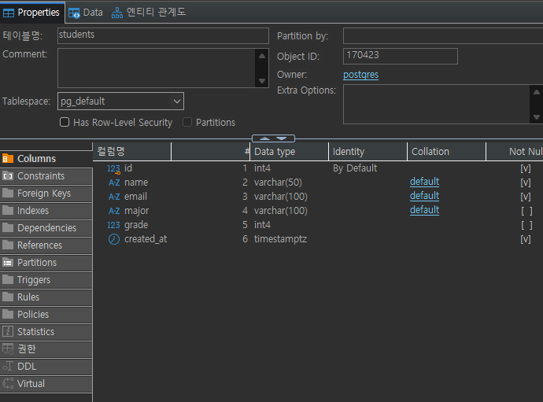
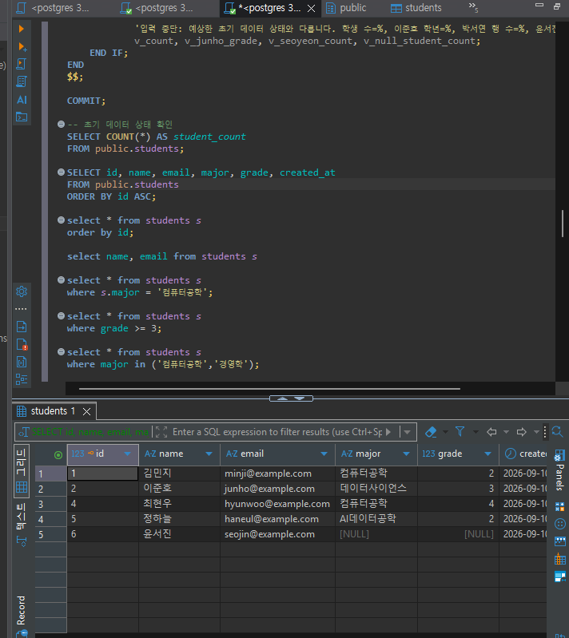
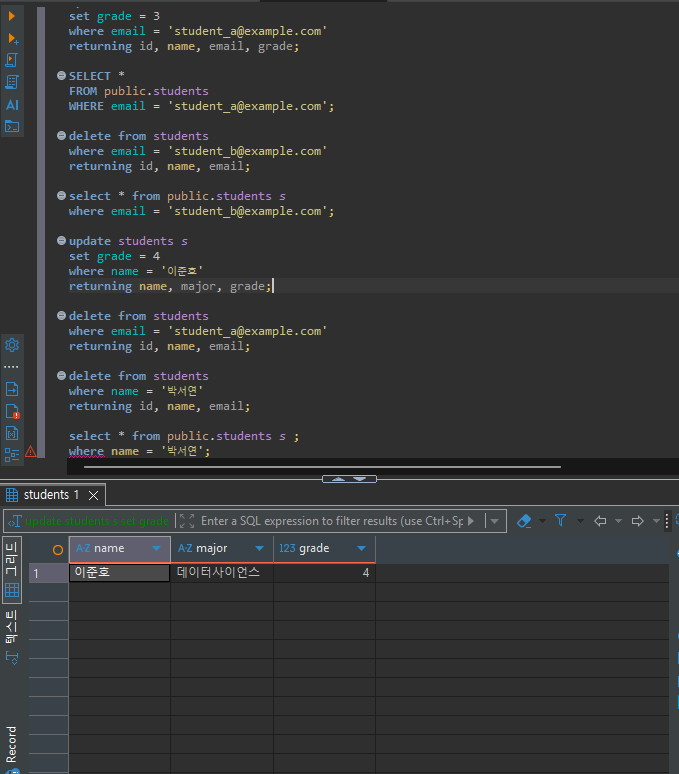
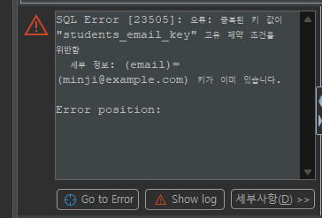
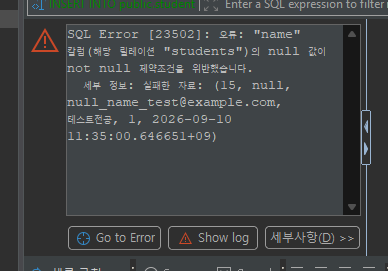

# Chapter 04 확장 실습 답안 템플릿

> **과제:** 관계형 데이터베이스와 SQL 시작하기  
> **사용 방법:** 이 파일을 내려받아 본인의 GitHub 저장소에 `chapter04_answer.md`라는 이름으로 저장한 뒤 실습하면서 바로 작성합니다.  
> **제출 방법:** LMS에는 파일을 직접 업로드하지 않고, **본인 GitHub 저장소의 `chapter04_answer.md` 파일 URL**을 제출합니다.

---

## 제출 전 주의

이 파일과 캡처 화면에는 실제 비밀번호, 전체 DB 접속 URL, API Key, 개인정보를 기록하지 않습니다.

```text
GitHub 계정 또는 별칭: donghyunwoo1222
과제 작성일: 9/10
사용한 AI 도구: claude
```

---

# 1. 실습 환경과 시작 상태 확인

다음을 실행합니다.

```sql
SELECT current_database();
SELECT current_user;
SELECT current_schema();
SHOW search_path;
SHOW transaction_read_only;
```

| 확인 항목 | 실제 결과 | 의미 |
| --- | --- | --- |
| current_database() | ai_database_book | 현재 연결된 DB |
| current_user | postgres | 현재 접속한 계정 |
| current_schema() | public | 현재 스키마 |
| search_path | "$user", public | 스키마를 생략하고 테이블을 조회하는 순서 |
| transaction_read_only | off | 트랜젝션 읽기 쓰기 가능 |

- [x] 현재 DB가 `ai_database_book`이다.
- [x] 변경 가능한 연결인지 확인했다.
- [x] 실행할 SQL 범위를 확인했다.
- [x] Auto-commit 상태를 확인했다.

### 변경 SQL을 실행하기 전에 현재 DB와 실행 범위를 확인해야 하는 이유

```text
변경 SQL(INSERT, UPDATE, DELETE 등)은 실행되는 순간 실제 데이터를 바꾸는 명령이라서, 
지금 접속한 곳이 정말 내가 의도한 데이터베이스와 스키마가 맞는지 먼저 확인해야 함.
```

---

# 2. `public.students` 구조 생성

## 2-1. 실행 전 예상

```text
테이블 이름: students
한 행의 의미: 학생 한 명
예상 행 수: 6
기본키: id
필수 열: id, name, email, created_at
중복을 막는 열: id
자동 생성 열: id
```

## 2-2. 실행 파일

```text
code/chapter04/01_create_students.sql
```

## 2-3. 실행 후 확인

```text
테이블 생성 성공 여부: 성공 
실제 행 수: 6
DBeaver에서 확인한 위치: ai_database_book.public.students
```

### 각 열의 역할

| 열 | 타입 | NULL 가능? | 역할 |
| --- | --- | --- | --- |
| id | int4 | X | ID |
| name | varchar | X | 이름 |
| email | varchar | X | 이메일 |
| major | varchar | O | 전공 |
| grade | int4 | O | 학년 |
| created_at | timestamptz | X | 가입시간 |

### `id`를 학번이나 학생 수로 해석하면 안 되는 이유

```
id 는 DB 내부에서 행을 구분하기 위해 자동으로 붙여지는 숫자이므로 중간에 delete로 삭제되더라도 id는 그대로 남아있다.

```

### 증거 화면

권장 경로:

```text
assignments/chapter04/images/step02_table.png
```



---

# 3. 샘플 데이터 6명 입력

## 3-1. 실행 전 예상

```text
현재 행 수: 0
실행 후 예상 행 수: 6
예상되는 NULL 포함 학생:  윤서진. major, grade
```

## 3-2. 실행 파일

```text
code/chapter04/02_insert_students.sql
```

## 3-3. 실제 결과

```text
실제 행 수: 6
이준호 grade: 3
박서연 존재 여부: o
윤서진 major: null
윤서진 grade: null
```

### 예상과 실제 비교

```text
예상과 실제가 일치했는가: 일치했다. 
다르다면 이유:
```

### `created_at` 값이 여러 행에서 같을 수 있는 이유

```text
created_at은 데이터가 서버에 입력된 시간인데, 방금 동시에 입력했으므로 시간이 동일하게 나온 것이다. 
```

---

# 4. SELECT 복습과 결과 검증

각 문제는 **SQL 실행 전에 예상 행 수를 먼저 작성**합니다.

| 번호 | 조회 문제 | 예상 행 수 | 실제 행 수 | 일치? | 다르면 이유 |
| ---: | --- | ---: | ---: | --- | --- |
| 1 | 전체 학생 | 6 | 6 | 일치 |  |
| 2 | 이름·이메일만 조회 | 6 | 6 | 일치 |  |
| 3 | 특정 전공(컴퓨터공학) | 2 | 2 | 일치 |  |
| 4 | 특정 학년 이상(>=2) | 2 | 2 | 일치 |  |
| 5 | 두 전공 중 하나(컴퓨터공학, 경영학) | 2 | 2 | 일치 |  |
| 6 | `grade IS NULL` | 1 | 1 | 일치 |  |
| 7 | 전공 `DISTINCT` | 5 | 5 | 일치 |  |
| 8 | 정렬 후 상위 3명 | 3 | 3 | 일치 |  |

## 4-1. 내가 직접 작성한 SQL 2개

```sql
-- 
select * from students s
order by major;

```

```text
이 SQL의 한 행 의미: 전공별로 정렬한 목록
예상 행 수: 6
실제 행 수: 6
```

```sql
-- 
select * from students s 
where name like '%하%';
```

```text
이 SQL의 한 행 의미: 가운데 글자에 '하'가 들어가는 학생
예상 행 수: 1
실제 행 수: 1
```

## 4-2. `= NULL` 대신 `IS NULL`을 사용하는 이유

```text
= 연산자는 두 값을 비교하는건데, null은 값 자체가 없는거라 비교할 수가 없다. 
```

## 4-3. `ORDER BY` 없이 결과 순서를 믿으면 안 되는 이유

```text
당장 id 순서대로 나오는 것처럼 보여도, 우연히 그렇게 보이는 것일 수도 있다. 따라서 원하는 정렬을 위해서는 반드시 정렬을 따로 해줘야한다.  
```

## 4-4. `DISTINCT`가 원본 데이터를 삭제하는 기능인가요?

```text
원본 데이터는 삭제하지 않는다. 
```

### 증거 화면

권장 경로:

```text
assignments/chapter04/images/step04_select.png
```



---

# 5. 내 가상 학생 2명 추가

실명·실제 이메일 대신 가상 데이터를 사용합니다.

## 5-1. 실행 전 계획

```text
학생 A
이름: 가상학생A
이메일: student_a@example.com
전공: 데이터과학
학년: 2

학생 B
이름: 가상학생B
이메일: student_b@example.com
전공: 인공지능
학년 또는 NULL: NULL

현재 행 수: 6
추가 후 예상 행 수: 8
```

## 5-2. 내가 실행한 INSERT

```sql
insert into public.students (name, email, major, grade)
values
    ('가상학생A', 'student_a@example.com', '데이터과학', 2),
    ('가상학생B', 'student_b@example.com', '인공지능', NULL)
returning id, name, email, major, grade;
```

## 5-3. 실제 결과

```text
RETURNING 또는 확인 SELECT 결과: 
7	가상학생A	student_a@example.com	데이터과학	2
8	가상학생B	student_b@example.com	인공지능    [NULL]
실제 전체 행 수: 8
예상과 일치 여부: 일치한다.
```

### 내가 일부 값을 NULL로 둔 이유 또는 NULL을 사용하지 않은 이유

```text
가상학생 B의 학년에 null 값을 사용했는데, 학년 정보를 입력받지 못한 학생이 있을 수도 있다고 생각해서 null값을 사용했다. 
```

---

# 6. 안전한 UPDATE

내가 추가한 가상 학생 한 명만 수정합니다.

## 6-1. 먼저 대상 확인 SELECT

```sql
SELECT *
FROM public.students
WHERE email = 'student_a@example.com';

```

```text
예상 대상 행 수:1
실제 대상 행 수:1
```

## 6-2. UPDATE

```sql
update students s 
set grade = 3
where email = 'student_a@example.com'
returning id, name, email, grade;
```

```text
예상 영향 행 수: 1
실제 영향 행 수: 1
RETURNING 결과: 7	가상학생A	student_a@example.com	3
```

## 6-3. UPDATE 후 재조회

```sql
SELECT *
FROM public.students
WHERE email = 'student_a@example.com';

```

### `WHERE` 없는 UPDATE를 실행하면 위험한 이유

```text
where로 지정하지 않으면 전체가 다 바뀌어버린다.
```

### 증거 화면

권장 경로:

```text
assignments/chapter04/images/step06_update.png
```



---

# 7. 안전한 DELETE

내가 추가한 가상 학생 한 명을 삭제합니다.

## 7-1. 삭제 전 확인

```sql
select * from public.students s 
where email = 'student_b@example.com'
```

```text
예상 대상 행 수: 1
실제 대상 행 수: 1
```

## 7-2. DELETE

```sql
delete from students 
where email = 'student_b@example.com'
returning id, name, email;
```

```text
예상 영향 행 수: 1
실제 영향 행 수: 1
RETURNING 결과: none
```

## 7-3. 삭제 후 재조회

```sql
select * from public.students s 
where email = 'student_b@example.com'
```

```text
삭제 후 같은 조건의 SELECT 결과 행 수: 0
```

### `DELETE` 성공 메시지만 보고 끝내지 않고 다시 SELECT해야 하는 이유

```text
내가 실제로 정확하게 쿼리를 작성한게 아닐 수도 있기 때문에 where 뒤에 이상한 조건을 걸어서 이상한 걸 지웠을 가능성도 있다. 따라서 확실하게 지웠는지 확인해야함
```

---

# 8. 본문 기준 UPDATE·DELETE 상태 검증

`04_update_delete_students.sql`을 본문 시작 상태에서 실행했다면 다음을 확인합니다.

```text
최종 학생 수: 5
이준호 grade: 4
박서연 존재 여부: X
```

본문 기준 기대 상태와 비교합니다.

```text
학생 수 = 5
이준호 grade = 4
박서연 = 0행
```

### 내 실제 결과가 기준과 다르다면 원인

```text

```

---

# 9. 의도한 실패 2개 관찰

> 실패 테스트는 데이터베이스 규칙이 실제로 데이터를 보호하는지 확인하는 실험입니다.

## 9-1. 중복 이메일 `UNIQUE` 오류

내가 사용한 SQL:

```sql
insert into students (name, email, major, grade)
values ('중복테스트','minji@example.com','테스트전공',1);
```

```text
오류 메시지 핵심 단서: 중복된 키 값 / 고유 제약 조건
왜 실패해야 맞는가: 이메일은 unique한 값이기 때문에 중복생성될 수 없다. 
어떤 규칙이 작동했는가: 고유 제약 조건에 의해 생성되지 않음
실패 후 기존 데이터가 어떻게 유지되었는가: 변화없음
```

## 9-2. 이름 `NULL` 입력 `NOT NULL` 오류

내가 사용한 SQL:


```sql
INSERT INTO public.students (name, email, major, grade)
VALUES (NULL, 'null_name_test@example.com', '테스트전공', 1);
```

```text
오류 메시지 핵심 단서: not null 제약조건 위반
왜 실패해야 맞는가: 이름은 not null이므로 null일 수 없다. 
어떤 규칙이 작동했는가: not null 제약조건 위반
```

### 실패한 INSERT 뒤 자동 생성 `id` 번호에 빈 구간이 생길 수 있어도 문제라고 단정할 수 없는 이유

```text
id는 GENERATED BY DEFAULT AS IDENTITY로 설정되어 있어서, INSERT 문이 실행될 때마다 
데이터베이스가 내부적으로 다음 번호를 미리 하나씩 소비하는 방식으로 동작함. 
이때 그 INSERT가 실제로 성공했는지 여부와는 상관없이 번호 자체는 이미 할당됨.
결과적으로 테이블에는 그 번호가 아예 존재하지 않게 되어 번호 사이에 빈 구간이 생길 수 있다. 
```

### 증거 화면

권장 경로:

```text
assignments/chapter04/images/step09_constraint_error.png
```




---

# 10. `verify_students.sql`로 최종 상태 확인

실행 파일:

```text
code/chapter04/verify_students.sql
```

```text
현재 전체 학생 수:5
NULL 개수:1
이준호 grade:4
박서연 존재 여부: X
현재 데이터 상태에서 예상과 다른 부분: 없다. 
```

### 검증 SQL을 따로 두면 좋은 이유

```text
실습이나 변경 작업 중에 쓰는 SQL(CREATE, INSERT, UPDATE, DELETE)은 
데이터를 직접 바꾸는 명령이라서, 실행하다가 실수가 섞이면 그 실수까지 결과에 반영되어 버림. 
반면 검증용 SQL은 SELECT처럼 데이터를 변경하지 않고 조회만 하기 때문에, 
몇 번을 실행해도 데이터에 영향을 주지 않으면서 현재 상태를 안전하게 확인할 수 있음.
```

---

# 11. AI를 SQL 작성자가 아니라 검토자로 활용

먼저 본인이 SQL을 작성한 뒤 AI에게 검토를 요청합니다.

## 11-1. 내가 작성한 SQL

```sql
UPDATE student 
SET grade = 3 
WHERE major = '데이터사이언스';
```

## 11-2. AI에게 전달한 핵심 요청

```text
나는 PostgreSQL 초보자입니다.
아래 SQL을 바로 다시 작성하지 말고 먼저 안전성을 검토해 주세요.
다음 순서로 답해 주세요.
1. 이 SQL이 영향을 줄 것으로 예상되는 행
2. WHERE 조건이 너무 넓거나 모호하지 않은지
3. NULL 처리에서 주의할 점
4. 실행 전에 같은 조건으로 확인할 SELECT
5. 실행 후 결과를 확인할 SELECT
6. 내가 놓친 위험이 있다면 질문 형태로 제시
```

## 11-3. AI 검토 결과

| AI 제안 | 수용 / 수정 / 거절 | 실제 검증 결과 | 나의 이유 |
| --- | --- | --- | --- |
| 테이블 이름을 student가 아니라 public.students로 수정 | 수정 | SELECT * FROM public.students LIMIT 1; 실행됨. student 테이블은 존재하지 않아 에러 발생 확인 | 실제 테이블명과 다르면 SQL 자체가 실행되지 않으므로 반드시 수정 필요했음 |
| 실행 전 같은 조건으로 SELECT해서 대상 행 수 확인 | 수용 | SELECT * FROM public.students WHERE major = '데이터사이언스'; 실행 결과 2행 나옴, 의도했던 대상과 일치함 확인 | 여러 행이 한 번에 바뀌는 게 맞는 의도인지 실행 전에 눈으로 확인하는 게 안전하다고 판단함 |
| RETURNING 절 추가해서 실행 직후 바뀐 행 바로 확인 | 수용 | UPDATE public.students SET grade = 3 WHERE major = '데이터사이언스' RETURNING id, name, major, grade; 실행해서 2행 반환됨, 바뀐 값 즉시 확인 | 별도 SELECT 없이도 변경된 행을 바로 볼 수 있어 검증 과정이 단순해져서 수용함 |

### AI가 예상한 영향 행 수와 실제 결과가 같았나요?

```text
네
```

### AI 답변을 실행 전에 검토해야 하는 이유

```text
AI는 지금 내 데이터베이스에 실제로 어떤 테이블이 있고 어떤 데이터가 있는지 직접 보고 있는게 아니기 때문에 테이블 이름을 틀리게 알려주거나, where조건이 실제로 몇 행에 걸리는지를 잘못 예상할 수 있다.
```

---

# 12. 내 서비스 테이블 하나 확장 설계

Chapter 01~03에서 정한 개인 서비스에서 **테이블 하나**를 선택합니다.

```text
서비스 이름: 카페주문
테이블 이름: menu_items
한 행의 의미: 메뉴 한 개
```

| 열 이름 | 저장할 값 | 타입 후보 | NULL 가능? | UNIQUE 후보? | 이유 |
| --- | --- | --- | --- | --- | --- |
| id | 메뉴를 구분하는 내부 번호 | INTEGER (IDENTITY) | 아니오 | 예 (자동 생성 기본키) | 행을 유일하게 식별하기 위한 내부 식별자 |
| name | 메뉴 이름 (예: 아메리카노) | VARCHAR(100) | 아니오 | 미정 | 메뉴 이름이 없으면 어떤 메뉴인지 알 수 없어서 필수로 판단함, 같은 이름이 사이즈별로 존재할 수도 있어 UNIQUE는 아직 확정 안 함 |
| category | 메뉴 분류 (예: 커피, 티, 디저트) | VARCHAR(50) | 예 | 아니오 | 아직 카테고리 체계가 확정되지 않아 비어있을 수 있다고 가정함 |
| price | 메뉴 가격 | INTEGER | 아니오 | 아니오 | 가격 없는 메뉴는 없다고 판단해 필수로 뒀지만, 가격 변동 이력까지 관리할지는 미정 |
| is_available | 현재 판매 가능 여부 | BOOLEAN | 아니오 | 아니오 | 품절이나 시즌 종료된 메뉴를 구분하려고 넣음, 기본값 처리 필요 |

```text
PK 후보: id
업무 식별자 후보: name (아직 사이즈, 옵션별로 이름을 어떻게 구성할지 확정 안 됨)
아직 미확정인 규칙: 같은 이름의 메뉴가 사이즈나 옵션별로 여러 행이 될 수 있는지, 
가격 변경 이력을 별도로 남겨야 하는지, 카테고리를 별도 테이블로 분리할지 여부가 
아직 정해지지 않아서 name의 UNIQUE 여부나 category 컬럼 구조는 확정하지 않았음
```

## 선택: CREATE TABLE 초안

> 아직 확정되지 않은 업무 규칙은 억지로 제약조건으로 만들지 않습니다.

```sql

```

### AI에게 검토받은 뒤 수정한 부분

```text

```

---

# 13. 최종 성찰

아래 문장은 본인의 말로 작성합니다.

```text
1. SQL 실행 성공과 올바른 대상 선택이 다른 이유는
   실행 성공은 SQL 엔진이 문법 오류 없이 명령을 처리했다는 뜻일 뿐, WHERE 조건이 
   실제로 의도한 행만 정확히 가리켰는지는 별개의 문제이기 때문 이다.

2. UPDATE와 DELETE 전에 SELECT를 먼저 해야 하는 이유는
   같은 조건으로 먼저 조회해서 실제로 몇 개 행이 대상이 되는지, 그 행이 정말 내가 
   수정하거나 지우려던 행이 맞는지 실행 전에 눈으로 확인하기 위해서 이다.

3. 영향받은 행 수를 확인해야 하는 이유는
   조건을 잘못 걸었을 경우 예상보다 많거나 적은 행이 바뀔 수 있는데, 실행 결과가 
   예상과 다를 수 있기 때문에 이를 실제로 비교해서 확인해야 하기 때문 이다.

4. UNIQUE 또는 NOT NULL 오류를 '보호 장치가 정상 동작한 결과'라고 볼 수 있는 이유는
   UNIQUE나 NOT NULL 제약조건이 없다면 중복되거나 비어있는 값이 그대로 저장되어 
   데이터 품질 문제가 생길 수 있는데, 오류가 발생했다는 건 그런 잘못된 입력을 
   제약조건이 실제로 막아냈다는 뜻이기 때문 이다.

5. AI가 SQL을 만들어 주더라도 내가 반드시 확인해야 하는 것은
   AI가 예상한 대상 행과 실제 데이터베이스에서 그 조건에 걸리는 행이 정말 같은지를, 
   직접 SELECT로 조회해서 확인하는 것 이다.
```

---

# 14. 제출 체크리스트

- [x] `chapter04_answer.md`를 본인 저장소에 만들었다.
- [x] 현재 DB와 실행 환경을 확인했다.
- [x] `public.students`를 생성했다.
- [x] 샘플 6명 입력 결과를 검증했다.
- [x] SELECT 문제에서 실행 전 예상 행 수를 작성했다.
- [x] 가상 학생 2명을 추가했다.
- [x] UPDATE 전후를 SELECT로 확인했다.
- [x] DELETE 전후를 SELECT로 확인했다.
- [x] UNIQUE 오류를 관찰했다.
- [x] NOT NULL 오류를 관찰했다.
- [x] `verify_students.sql`로 상태를 확인했다.
- [x] AI 제안을 실제 SQL 결과와 비교했다.
- [x] 개인 서비스 테이블 하나를 확장 설계했다.
- [x] 핵심 캡처는 3~4장 정도로 제한했다.
- [x] 비밀번호·개인정보가 캡처에 없다.
- [x] Markdown 이미지가 GitHub 웹 화면에서 정상 표시된다.
- [x] commit/push를 완료했다.


---

# 15. LMS 제출 URL

아래 형식의 **본인 GitHub 파일 URL**을 LMS에 제출합니다.

```text
https://github.com/<본인-GitHub-ID>/<본인-저장소>/blob/main/assignments/chapter04/chapter04_answer.md
```

내 제출 URL:

```text

```

> 교수자 템플릿 URL이나 저장소 메인 URL이 아니라 **작성 완료된 본인 `chapter04_answer.md` 파일 화면 URL**을 제출합니다.