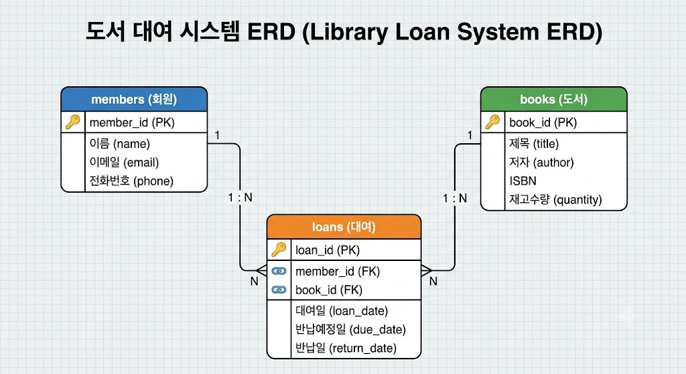
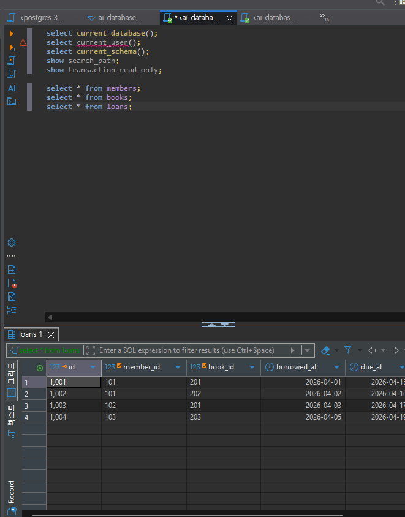
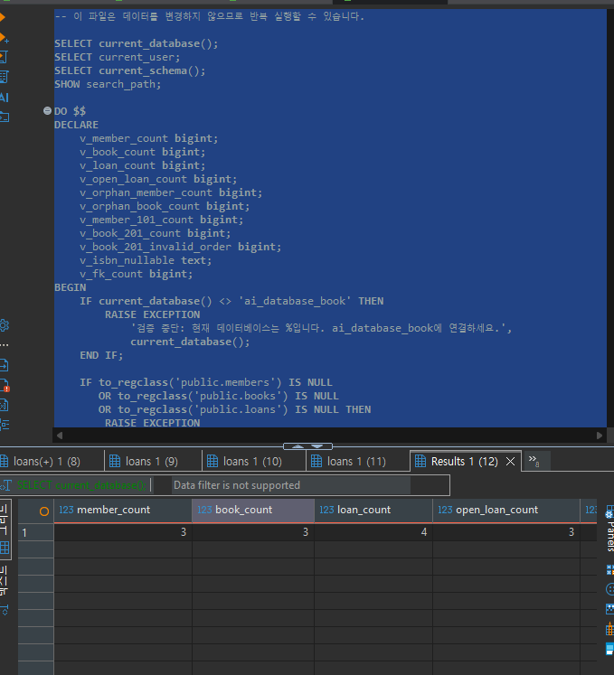
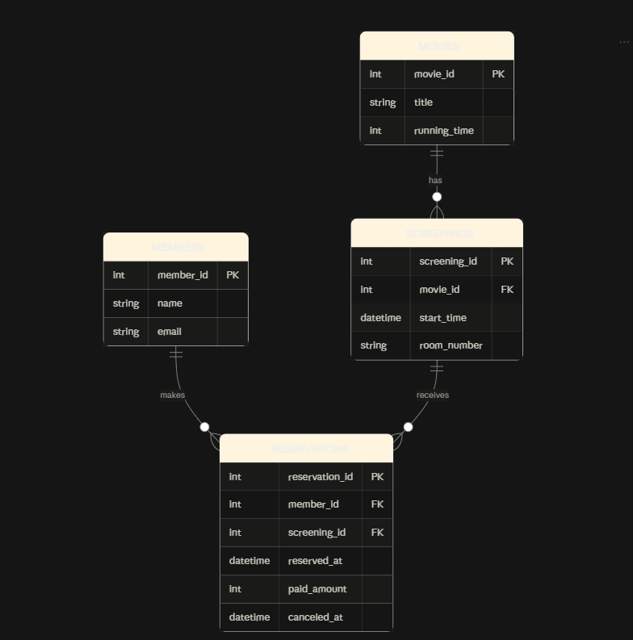

# Chapter 05 확장 실습 답안 템플릿

> **과제:** 요구사항에서 데이터 모델과 ERD 만들기  
> **사용 방법:** 이 파일을 내려받아 본인의 GitHub 저장소에 `chapter05_answer.md`라는 이름으로 저장한 뒤 실습하면서 바로 작성합니다.  
> **제출 방법:** LMS에는 파일을 직접 업로드하지 않고, **본인 GitHub 저장소의 `chapter05_answer.md` 파일 URL**을 제출합니다.

---

## 제출 전 주의

이 파일과 캡처 화면에는 실제 비밀번호, 전체 DB 접속 URL, API Key, 개인정보를 기록하지 않습니다.

```text
GitHub 계정 또는 별칭: donghyunwoo1222
과제 작성일: `26.09.11
사용한 AI 도구: claude
```

---

# 1. Chapter 05 핵심 개념 복습

```text
요구사항에서 바로 테이블부터 만들면 위험한 이유: 문장에 나오는 명사를 보자마자 테이블 이름으로 정해버리면, 그게 진짜 독립적으로 관리해야 하는 대상인지 아니면 다른 테이블을 설명하는 속성일 뿐인지 판단하는 과정을 건너뛰게 된다. 그러다 나중에 구조를 다시 뜯어고쳐야 하는 일이 생긴다.

한 행의 의미를 먼저 정해야 하는 이유: 한 행이 어떤 사실 하나를 나타내는지 먼저 정하지 않으면 어떤 컬럼을 넣어야 하는지, PK를 뭘로 잡아야 하는지 기준이 없다. 행의 의미가 애매하면 같은 사실이 여러 행에 흩어지거나 중복 데이터가 들어갈 수 있다.

확정 요구사항과 미확정 정책을 구분해야 하는 이유: 아직 정해지지 않은 정책을 미리 제약조건으로 박아버리면, 정책이 바뀔 때마다 스키마를 계속 고쳐야 한다. 확정된 것과 논의 중인 것을 나눠 놓으면 나중에 수정할 범위를 줄일 수 있다. 여기서 말하는 제약조건은 unique나 check 같은 것들. 

PK와 업무상 고유값 후보의 차이: PK는 내부식별자로 내부 DB에서 구별하기 위해 사용하는 것이고 업무 식별자는 일상생활에서 구분을 위해 사용하는 것이라는 차이가 있다.

N:M 관계를 그대로 두지 않고 연결 테이블을 검토하는 이유: 관계형 모델에서는 N:M 관계를 할 수 없어서 연결 테이블을 두어 1:N 1:N 관계로 연결한다.
```

---

# 2. 도서 대여 요구사항 R-01~R-07 다시 분해

| 요구사항 | 관리 대상 / 사건 | 속성 후보 | 관계 / 규칙 후보 | 미확정 질문 |
| --- | --- | --- | --- | --- |
| R-01 (회원가입) | 회원 (대상 엔터티) | 이름, 이메일, 전화번호 | 없음, 기준이 되는 엔터티 | 이메일이 진짜 유일해야 하는지, 전화번호도 필수인지 |
| R-02 (도서 등록) | 도서 (대상 엔터티) | 제목, 저자, ISBN, 재고수량 | 없음 | ISBN 없는 책은 어떻게 등록할지 |
| R-03 (도서 대여 가능) | 대여 (사건) | 대여일 | 회원 1:N 대여, 도서 1:N 대여 | 한 회원이 동시에 몇 권까지 빌릴 수 있는지 |
| R-04 (대여일/반납예정일 기록) | 대여 사건의 속성 | 대여일, 반납예정일 | 반납예정일 = 대여일 + 대여기간 | 대여기간이 책마다 다른지, 고정인지 |
| R-05 (반납일 기록) | 대여 사건의 상태 | 반납일 | 반납일 없으면 대여중으로 판단 | 반납일 null 허용 여부 |
| R-06 (연체 처리) | 대여 사건의 파생 상태 | 없음(계산 가능) | 오늘 날짜 > 반납예정일이고 반납일 없으면 연체 | 연체를 컬럼으로 저장할지, 그때그때 계산할지 |
| R-07 (동시 대여 가능) | 회원과 대여의 관계 성격 | 없음 | 회원 1:N 대여, 동시에 여러 건 가능 | 동시 대여 가능 권수 제한이 있는지 |

### 본문과 비교한 뒤 수정한 내용

```text
처음에 놓친 부분: 대여 기록을 그냥 회원이랑 도서를 이어주는 표 정도로만 생각했는데, 대여일 반납예정일 반납일처럼 그 자체로 의미 있는 정보를 담고 있어서 독립된 사건으로 봐야 한다는 걸 놓쳤다.

처음에 잘못 분류한 부분: 반납예정일이랑 연체 여부를 도서 테이블 속성이라고 생각했는데, 같은 책이라도 누가 언제 빌렸는지에 따라 달라지는 값이라서 도서가 아니라 대여 사건에 속하는 속성이었다.

수정한 이유: 반납예정일이나 연체 여부는 도서 자체의 성질이 아니라 대여라는 사건이 일어날 때마다 새로 생기는 값이기 때문에, 도서 테이블이 아니라 loans 쪽에 둬야 맞다는 걸 알게 됐다.
```

---

# 3. 확정 규칙과 미확정 정책 구분

## 3-1. 확정된 규칙

```text
1. 회원은 이름과 이메일 정보를 가진다.
2. 도서는 제목, 저자, ISBN 정보를 가진다.
3. 대여가 발생하면 대여일이 기록된다.
4. 반납하면 반납일이 기록된다.
5. 한 회원은 여러 건의 대여 기록을 가질 수 있다.
```

## 3-2. 미확정 질문

```text
Q1. 이메일을 회원마다 반드시 유일하게 관리해야 하는지, 같은 이메일로 여러 명이 가입할 수 있는지
Q2. 한 회원이 동시에 대여할 수 있는 책 수에 제한이 있는지
Q3. 연체됐을 때 연체료를 부과하는지, 그냥 대여만 정지시키는지
Q4. ISBN이 없는 책(기증받은 책, 옛날 책)은 시스템에 어떻게 등록할지
Q5. 같은 책을 여러 권 보유하고 있을 때 각 권을 따로 구분해서 관리할지, 재고 수량으로만 관리할지
```

### 미확정 정책을 바로 `UNIQUE`, `CHECK`, 삭제 규칙으로 구현하면 위험한 이유

```text
아직 정해지지 않은 정책을 제약조건으로 못박아버리면, 나중에 정책이 바뀌었을 때 이미 쌓인 데이터랑 충돌이 날 수 있다. 예를 들어 이메일을 UNIQUE로 걸어놨는데 나중에 이메일 공유를 허용하기로 하면, 제약조건도 풀어야 하고 그 사이 들어온 데이터도 다시 확인해야 한다. 그래서 확실하게 정해진 규칙만 제약조건으로 걸고, 애매한 부분은 일단 애플리케이션 로직 쪽에서 처리하는 게 안전하다.
```

---

# 4. 엔터티·속성·사건 후보 구분

| 후보 | 대상 엔터티 / 사건 엔터티 / 속성 | 판단 근거 | 독립 식별 필요? |
| --- | --- | --- | --- |
| 회원 | 대상 엔터티 | 시스템 안에서 계속 참조되는 대상이고, 자기만의 속성(이름, 이메일)을 가지고 있어서 | 필요함, 대여 기록과 연결하려면 구분해야 함 |
| 도서 | 대상 엔터티 | 여러 대여 기록에서 반복해서 참조되는 대상이고 자기만의 속성(제목, 저자, ISBN)을 가지고 있어서 | 필요함 |
| 대여 기록 | 사건 엔터티 | 회원과 도서가 만나서 발생하는 사건이고, 대여일 반납예정일 반납일처럼 사건 자체에만 속하는 속성이 있어서 | 필요함, 한 건 한 건 구분해야 언제 누가 뭘 빌렸는지 알 수 있음 |
| 이메일 | 속성 | 회원이라는 대상을 설명하는 정보일 뿐이고 독립적으로 관리할 이유가 없어서 | 필요없음 |
| ISBN | 속성(업무상 고유값 후보) | 도서를 설명하는 정보이고 도서 엔터티 안에 속한 값이라서 | 필요없음, 도서 안에서 고유값으로만 쓰임 |
| 반납예정일 | 속성 | 대여라는 사건에 속하는 값이고 그 자체로 독립적인 대상이 아니라서 | 필요없음 |

### “명사가 보이면 무조건 테이블”이 아닌 이유

```text
요구사항 문장을 읽다 보면 이메일이나 ISBN, 반납예정일처럼 명사 형태로 나오는 단어가 많은데, 이런 걸 다 테이블로 만들면 안 된다. 이메일이나 반납예정일은 그 자체로 독립적으로 존재하는 게 아니라 회원이나 대여 기록 같은 더 큰 대상을 설명하는 정보일 뿐이기 때문이다. 명사가 나올 때마다 이게 혼자서도 의미가 있는 대상인지, 다른 대상을 설명하는 속성일 뿐인지를 먼저 따져봐야 한다.
```

---

# 5. 테이블별 한 행의 의미와 키 후보

| 테이블 | 한 행의 의미 | PK 후보 | 업무상 고유값 후보 | FK 후보 |
| --- | --- | --- | --- | --- |
| members | 회원 한 명에 대한 정보 | member_id | 이메일 | 없음 |
| books | 도서 한 종류에 대한 정보 | book_id | ISBN | 없음 |
| loans | 회원 한 명이 도서 한 권을 대여한 사건 한 건 | loan_id | 딱히 없음, 회원+도서+대여일을 합쳐도 완전히 유일하다고 보장하기 애매함 | member_id, book_id |

### `members.email`을 지금 바로 UNIQUE라고 확정하지 않는 이유

```text
이메일을 회원마다 유일하게 쓸지, 가족이나 단체 회원처럼 이메일을 공유하는 경우를 허용할지 아직 정책이 안 정해졌기 때문이다. 지금 UNIQUE로 걸어놨다가 나중에 공유 이메일을 허용하기로 하면 제약조건도 풀어야 하고 이미 들어간 데이터도 다시 확인해야 해서, 정책이 확정되기 전까지는 섣불리 걸지 않는 게 낫다.
```

### `books.isbn`을 지금 바로 NOT NULL + UNIQUE라고 확정하지 않는 이유

```text
모든 책이 ISBN을 가지고 있다고 확신할 수 없기 때문이다. 오래된 책이나 기증받은 책, 자체 제작 자료는 ISBN이 없을 수도 있는데, NOT NULL로 걸어버리면 그런 책은 아예 등록을 못 하게 된다. ISBN 유무에 대한 정책이 확실해지기 전까지는 NOT NULL이나 UNIQUE를 바로 걸면 안 된다.
```

---

# 6. 관계를 양방향 문장으로 작성

## 6-1. `members ↔ loans`

```text
회원 한 명은 여러 건의 대여 기록을 가질 수 있다.

대여 기록 한 건은 딱 한 명의 회원에게만 속한다.

카디널리티: 1:N (회원 1, 대여기록 N)
선택성에서 확인할 점: 회원가입만 하고 한 번도 책을 안 빌린 회원이 있을 수 있어서 회원 쪽은 선택적이고, 대여기록 쪽은 반드시 회원이 있어야 하니까 필수인지 확인해야 한다.
```

## 6-2. `books ↔ loans`

```text
도서 한 종류는 여러 건의 대여 기록에 등장할 수 있다.

대여 기록 한 건은 딱 한 종류의 도서에만 연결된다.

카디널리티: 1:N (도서 1, 대여기록 N)
선택성에서 확인할 점: 아직 한 번도 안 빌려진 도서가 있을 수 있어서 도서 쪽은 선택적이고, 대여기록 쪽은 반드시 도서가 있어야 하니까 필수인지 확인해야 한다.
```

## 6-3. `members ↔ books`를 직접 N:M으로 저장하지 않고 `loans`를 두는 이유

```text
회원과 도서를 그냥 N:M으로 직접 연결하면 누가 언제 빌렸는지, 언제까지 반납해야 하는지, 실제로 반납했는지 같은 정보를 담을 자리가 없다. SQL에서는 N:M 관계를 테이블 하나로 바로 표현할 수 없기 때문에, 중간에 loans를 두고 회원 대 loans는 1:N, 도서 대 loans는 1:N으로 나눠서 연결해야 한다.
```

### `loans`가 단순 연결표가 아니라 사건 엔터티라고 볼 수 있는 이유

```text
그냥 회원과 도서를 이어주기만 하는 표라면 member_id랑 book_id만 있어도 되는데, loans는 대여일, 반납예정일, 반납일처럼 그 자체로 의미 있는 정보를 담고 있다. 이런 정보는 회원이나 도서의 속성이 아니라 "누가 언제 무슨 책을 빌려서 언제 반납했다"는 하나의 사건을 나타내는 정보라서, loans는 단순 연결표가 아니라 독립적인 사건 엔터티로 봐야 한다.
```

---

# 7. 도서 대여 ERD 초안

```text
members
  PK: member_id
  주요 속성: 이름, 이메일, 전화번호

books
  PK: book_id
  주요 속성: 제목, 저자, ISBN, 재고수량

loans
  PK: loan_id
  FK: member_id (members 참조), book_id (books 참조)
  주요 속성: 대여일, 반납예정일, 반납일

관계
  members 1 : N loans
  books 1 : N loans
```

권장 이미지 경로:

```text
assignments/chapter05/images/step07_library_erd.png
```

```markdown

```

      

### ERD를 그린 뒤 수정한 부분

```text
처음엔 members랑 books를 화살표로 바로 연결하려고 했는데, N:M 관계라서 직접 못 그리고 중간에 loans를 넣어서 1:N, 1:N으로 나눠 그려야 한다는 걸 다시 깨달았다.
```

---
# 8. PostgreSQL로 도서 대여 모델 구현 확인

## 8-1. 현재 환경 확인

```sql
SELECT current_database();
SELECT current_user;
SELECT current_schema(); 
SHOW search_path;
SHOW transaction_read_only;
```

```text
현재 DB: ai_database_book
현재 사용자: postgres
현재 스키마: public
search_path: "$user",public
읽기 전용 여부: off
```

- [x] 현재 DB가 `ai_database_book`이다.
- [x] 실행 범위를 확인했다.
- [x] Auto-commit 상태를 확인했다.

## 8-2. 스키마 생성 SQL 실행

사용 파일:

```text
code/chapter05/01_library_schema.sql
```

실행 전 예상:

```text
생성될 테이블 수: 3
생성 순서: members -> books -> loans
각 테이블 예상 행 수: members:3, books:3, loans:3
```

실행 후 실제:

```text
members 존재: o
books 존재: o
loans 존재: o 
각 테이블 행 수: members:3, books:3, loans:4
```

### `loans`를 마지막에 만드는 이유

```text
부모 테이블이 먼저 있어야 참조 구조를 만들기 쉽다. 
```

---

# 9. 샘플 데이터 입력과 관계 관찰

사용 파일:

```text
code/chapter05/02_library_seed.sql
```

## 9-1. 실행 전 예상

```text
members 예상 행 수:3
books 예상 행 수:3
loans 예상 행 수:4
미반납 예상 건수:3
회원 101 대여 예상 건수:2
도서 201 대여 예상 건수:2
```

## 9-2. 실제 결과

```text
members 실제 행 수:3
books 실제 행 수:3
loans 실제 행 수:4
미반납 실제 건수:3
회원 101 대여 실제 건수:2
도서 201 대여 실제 건수:2
```

### 샘플 데이터에서 확인한 1:N 관계

```text
members1-Nloans , books1-Nloans
```

### `returned_at = NULL`이 의미하는 것

```text
반납되지 않음
```

### 증거 화면

권장 경로:

```text
assignments/chapter05/images/step09_seed_result.png
```

`여기에 샘플 데이터 또는 관계 확인 화면을 삽입하세요.`

---

# 10. 검증 SQL 실행

사용 파일:

```text
code/chapter05/03_library_validation.sql
```

## 10-1. 결과 기록

```text
members =3
books =3
loans =4
미반납 건수 =3
회원 101 대여 이력 =2
도서 201 대여 이력 =2
회원 참조 고아 행 =0
도서 참조 고아 행 =0
loans FK 개수 =2
검증 최종 메시지 = loans의 member_id와 book_id가 모두 실제 존재하는 회원, 도서를 가리키고 있고 고아 행이 없어서 참조 무결성이 잘 유지되고 있음을 확인함
```

### 단순히 테이블 3개가 생성되었다고 설계 검증이 끝난 것이 아닌 이유

```text
테이블이 만들어졌다는 건 구조만 존재한다는 뜻이고, 그 구조 안에 들어간 데이터가 실제로 말이 되는지는 별개의 문제다. 예를 들어 loans에 있는 member_id가 members 테이블에 진짜 존재하는 회원인지, book_id가 진짜 존재하는 책인지 하나씩 확인해봐야 한다. 그렇지 않으면 테이블은 세 개 있는데 실제로는 이미 탈퇴한 회원의 대여 기록이 남아있거나, 존재하지 않는 책을 빌린 것처럼 데이터가 꼬여 있을 수 있다. 그래서 테이블 생성 자체보다 그 안의 관계와 값이 실제로 맞는지 확인하는 과정이 검증의 핵심이다.
```

### 증거 화면

권장 경로:

```text
assignments/chapter05/images/step10_validation.png
```



---

# 11. 작은 시나리오로 모델 검증

| 시나리오 | 표현 가능? | 이유 | 추가 확인할 정책 |
| --- | --- | --- | --- |
| 회원 A가 서로 다른 책 2권을 대여 | 가능 | 회원 한 명이 여러 loans 행을 가질 수 있어서 book_id가 다른 두 행을 만들면 표현된다 | 동시에 몇 권까지 빌릴 수 있는지 |
| 같은 책을 시간 차를 두고 다시 대여 | 가능 | 같은 book_id로 대여일이 다른 loans 행을 여러 개 만들면 되기 때문 | 이전 대여를 반드시 반납해야 재대여 가능한지 |
| 아직 반납하지 않은 대여 | 가능 | returned_at을 비워둔 채로 저장하면 되기 때문 | returned_at을 null로 허용할지 |
| 회원은 있지만 대여 기록이 없음 | 가능 | members와 loans는 1대N 관계이고 N이 0이어도 members 쪽에는 아무 문제가 없기 때문 | 없음 |
| ISBN이 없는 도서 | 가능 | ISBN을 NOT NULL로 걸어두지 않았다면 비워둔 채 저장할 수 있기 때문 | ISBN을 필수로 할지 말지 정책 |
| 같은 ISBN의 실물 복본 2권 | 불가능 | 지금 모델은 book_id 하나가 같은 종류의 책 한 종을 나타낼 뿐, 실물 한 권 한 권을 구분하는 값이 없기 때문 | 복본을 개별적으로 관리할지, 재고 수량으로만 관리할지 |
| 한 도서에 저자 2명 | 불가능 | books에 저자가 하나의 값으로만 들어가는 속성이라서 여러 명을 넣을 자리가 없기 때문 | 저자를 별도 테이블로 빼서 N:M으로 관리할지 |
| 같은 도서를 두 명이 동시에 대여 | 표현은 가능하지만 막을 방법 없음 | 지금 모델은 재고 수량을 확인하는 규칙이 없어서 같은 book_id로 loans 행이 여러 개 동시에 생겨도 DB가 막아주지 않기 때문 | 재고 수량이 0일 때 대여를 막는 규칙이 필요한지 |

### 현재 Chapter 05 모델의 한계 3가지

```text
1. 같은 ISBN이라도 실물 복본이 여러 권 있을 때 각 권을 따로 구분해서 관리하지 못한다.
2. 저자가 여러 명인 책을 제대로 표현하지 못한다. 저자를 books 테이블 안의 속성 하나로만 넣어놨기 때문이다.
3. 재고가 없는 책도 대여가 되는 걸 막는 장치가 없다. 재고 수량과 실제 대여 가능 여부를 연결하는 규칙이 빠져 있다.
```

---

# 12. Chapter 01~04 개인 서비스 요구사항 작성

```text
서비스 이름: 영화 예매
서비스 목적: 영화를 예매함
```

## 12-1. 요구사항

```text
P05-R01. 회원은 이름과 이메일 정보를 가지고 가입한다.
P05-R02. 영화는 제목과 러닝타임 정보를 가진다.
P05-R03. 상영관은 상영관 번호와 좌석 수 정보를 가진다.
P05-R04. 특정 영화가 특정 상영관에서 특정 시간에 상영되는 상영 회차가 존재한다.
P05-R05. 회원은 특정 상영 회차를 예매할 수 있다.
P05-R06. 예매가 발생하면 예매일시와 결제금액이 기록된다.
P05-R07. 예매를 취소하면 취소일시가 기록된다.
P05-R08. 한 회원은 여러 건의 예매 기록을 가질 수 있다.
```

## 12-2. 미확정 질문

```text
P05-Q01. 좌석을 지정해서 예매하는지, 좌석 없이 인원수만 예매하는지
P05-Q02. 취소했을 때 환불을 전액 해줄지 부분 환불인지 정책이 있는지
P05-Q03. 한 회원이 같은 회차에 여러 좌석을 한 번에 예매할 수 있는지
```

---

# 13. 개인 서비스 모델 초안

## 13-1. 엔터티·사건 후보표

| 후보 | 대상 / 사건 | 한 행의 의미 | 주요 속성 | PK 후보 | 업무 식별자 후보 |
| --- | --- | --- | --- | --- | --- |
| members | 대상 | 회원 한 명 | 이름, 이메일 | member_id | 이메일 |
| movies | 대상 | 영화 한 편 | 제목, 러닝타임 | movie_id | 없음 |
| screenings | 사건 | 특정 영화가 특정 상영관, 특정 시간에 상영되는 회차 하나 | 상영일시, 상영관번호 | screening_id | 없음 |
| reservations | 사건 | 회원 한 명이 특정 상영 회차를 예매한 사건 하나 | 예매일시, 결제금액, 취소일시 | reservation_id | 없음 |

## 13-2. 관계 문장

```text
관계 1: members ↔ reservations
회원 한 명은 여러 건의 예매 기록을 가질 수 있다.
예매 기록 한 건은 딱 한 명의 회원에게만 속한다.

관계 2: movies ↔ screenings
영화 한 편은 여러 개의 상영 회차를 가질 수 있다.
상영 회차 한 건은 딱 한 편의 영화에만 속한다.

관계 3: screenings ↔ reservations
상영 회차 한 건은 여러 건의 예매를 받을 수 있다.
예매 기록 한 건은 딱 하나의 상영 회차에만 속한다.
```

## 13-3. N:M 관계 검토

```text
N:M 관계 후보: members ↔ screenings, 한 회원이 여러 회차를 예매할 수 있고 한 회차도 여러 회원이 예매할 수 있어서 N:M 관계다.
연결 테이블 후보: reservations
연결 테이블 한 행의 의미: 회원 한 명이 특정 상영 회차를 예매한 사건 하나
연결 테이블 자체에 필요한 사건 속성: 예매일시, 결제금액, 취소일시
```

---

# 14. 개인 서비스 ERD 초안

```text
members
  PK: member_id
  주요 속성: 이름, 이메일

movies
  PK: movie_id
  주요 속성: 제목, 러닝타임

screenings
  PK: screening_id
  FK: movie_id (movies 참조)
  주요 속성: 상영일시, 상영관번호

reservations
  PK: reservation_id
  FK: member_id (members 참조), screening_id (screenings 참조)
  주요 속성: 예매일시, 결제금액, 취소일시

카디널리티
  movies 1 : N screenings
  members 1 : N reservations
  screenings 1 : N reservations
```

권장 이미지 경로:

```text
assignments/chapter05/images/step14_my_erd.png
```



### ERD의 각 테이블이 어떤 요구사항에서 나왔는지 설명

| 테이블 | 근거 요구사항 ID | 한 행의 의미 |
| --- | --- | --- |
| members | P05-R01, P05-R08 | 회원 한 명 |
| movies | P05-R02 | 영화 한 편 |
| screenings | P05-R03, P05-R04 | 특정 영화가 특정 상영관, 특정 시간에 상영되는 회차 하나 |
| reservations | P05-R05, P05-R06, P05-R07, P05-R08 | 회원 한 명이 특정 상영 회차를 예매한 사건 하나 |

---

# 15. 요구사항 추적표

| 요구사항 ID | 데이터 모델 반영 위치 | 검증 방법 | 상태 |
| --- | --- | --- | --- |
| P05-R01 | members 테이블의 이름, 이메일 속성 | 회원 데이터를 넣어보고 이름과 이메일이 잘 저장되는지 확인 | 반영 |
| P05-R02 | movies 테이블의 제목, 러닝타임 속성 | 영화 데이터를 넣어보고 조회되는지 확인 | 반영 |
| P05-R03 | screenings 테이블의 상영관번호 속성 | 상영관번호가 잘 저장되는지 확인 | 확인필요, 좌석 수 정보를 담을 자리가 아직 없음 |
| P05-R04 | screenings 테이블 전체, movies와 1:N 관계 | 한 영화로 여러 회차를 만들어보고 movie_id가 제대로 연결되는지 확인 | 반영 |
| P05-R05 | reservations 테이블, members·screenings와 1:N 관계 | 회원 하나로 회차 하나를 예매해보고 member_id, screening_id가 제대로 들어가는지 확인 | 반영 |
| P05-R06 | reservations 테이블의 예매일시, 결제금액 속성 | 예매를 만들어보고 두 값이 같이 저장되는지 확인 | 반영 |
| P05-R07 | reservations 테이블의 취소일시 속성 | 예매를 취소해보고 취소일시만 채워지고 나머지 값은 남아있는지 확인 | 반영 |
| P05-R08 | members와 reservations의 1:N 관계 | 같은 회원으로 예매를 여러 건 만들어보고 전부 조회되는지 확인 | 반영 |

### ERD 그림만으로 요구사항 누락을 발견하기 어려운 이유

```text
ERD는 테이블과 관계선만 보여줄 뿐, 그 뒤에 있는 요구사항 문장까지 같이 보여주지 않는다. 그래서 그림만 보면 테이블 네 개랑 관계선이 잘 그려져 있으니까 다 됐다고 착각하기 쉽다. 실제로는 P05-R03에서 말한 좌석 수 정보처럼, 요구사항에 분명히 있었는데 어느 테이블에도 반영이 안 된 속성이 있을 수 있다. 이런 건 요구사항 목록을 하나씩 짚어가면서 테이블과 대조해봐야만 발견할 수 있고, 그림만 훑어봐서는 절대 보이지 않는다.
```

---

# 16. 개인 서비스 작은 데이터 시나리오 검증

```text
사용자/대상 A: 회원 김민수 (member_id=1)
사용자/대상 B: 회원 이서연 (member_id=2)
대상 X: 영화 "인터스텔라" (movie_id=1)
대상 Y: 영화 "듄" (movie_id=2)
사건 1: 김민수가 인터스텔라 9월 12일 19시 회차를 예매함
사건 2: 이서연이 인터스텔라 9월 12일 19시 회차를 예매함 (김민수와 같은 회차)
사건 3: 김민수가 예매한 인터스텔라 예매를 취소함
사건 4: 김민수가 듄 9월 13일 20시 회차를 새로 예매함
```

### 이 시나리오를 현재 ERD로 저장할 수 있는가?

```text
저장할 수 있다. 회원 두 명은 members에 각각 한 행씩, 영화 두 편은 movies에 각각 한 행씩 들어간다. 인터스텔라 9월 12일 19시 회차와 듄 9월 13일 20시 회차는 screenings에 각각 한 행씩 들어가고, 같은 회차를 두 명이 예매하는 것도 reservations에 member_id만 다르고 screening_id는 같은 두 행으로 표현된다. 취소도 canceled_at만 채워주면 되고, 새 예매도 reservations에 새 행 하나 추가하면 된다.
```

### 저장하기 어려운 상황 또는 모호한 부분

```text
좌석을 지정하는 부분은 지금 모델로 표현이 안 된다. 김민수와 이서연이 같은 회차를 예매했을 때 둘이 같은 좌석을 고르면 안 되는데, 지금 reservations에는 좌석 정보를 담을 속성이 없어서 좌석 중복 문제를 아예 확인할 수가 없다. 또 취소한 예매(사건 3)와 새 예매(사건 4)가 같은 회원의 서로 다른 예매 건이라는 게 명확히 구분되는지도, canceled_at 값 하나만으로 판단하기에는 조금 애매하다.
```

### 시나리오 검증 후 수정한 ERD 내용

```text
좌석 지정 여부가 아직 미확정 정책이라서 지금 당장 컬럼을 추가하지는 않았고, 대신 P05-Q01(좌석을 지정해서 예매하는지)로 이미 남겨둔 미확정 질문에 이 상황을 근거로 덧붙여뒀다. 정책이 확정되면 reservations에 seat_number 속성을 추가하는 방향으로 갈 것 같다.
```

---

# 17. AI를 설계자가 아니라 리뷰어로 활용

## 17-1. AI에게 전달한 핵심 자료

```text
요구사항:
P05-R01 회원은 이름과 이메일 정보를 가지고 가입한다.
P05-R02 영화는 제목과 러닝타임 정보를 가진다.
P05-R03 상영관은 상영관 번호와 좌석 수 정보를 가진다.
P05-R04 특정 영화가 특정 상영관에서 특정 시간에 상영되는 상영 회차가 존재한다.
P05-R05 회원은 특정 상영 회차를 예매할 수 있다.
P05-R06 예매가 발생하면 예매일시와 결제금액이 기록된다.
P05-R07 예매를 취소하면 취소일시가 기록된다.
P05-R08 한 회원은 여러 건의 예매 기록을 가질 수 있다.

미확정 질문:
P05-Q01 좌석을 지정해서 예매하는지, 좌석 없이 인원수만 예매하는지
P05-Q02 취소했을 때 환불을 전액 해줄지 부분 환불인지 정책이 있는지
P05-Q03 한 회원이 같은 회차에 여러 좌석을 한 번에 예매할 수 있는지

테이블별 한 행 의미:
members: 회원 한 명
movies: 영화 한 편
screenings: 특정 영화가 특정 상영관, 특정 시간에 상영되는 회차 하나
reservations: 회원 한 명이 특정 상영 회차를 예매한 사건 하나

관계 문장:
회원 한 명은 여러 건의 예매 기록을 가질 수 있고, 예매 기록 한 건은 딱 한 명의 회원에게만 속한다.
영화 한 편은 여러 개의 상영 회차를 가질 수 있고, 상영 회차 한 건은 딱 한 편의 영화에만 속한다.
상영 회차 한 건은 여러 건의 예매를 받을 수 있고, 예매 기록 한 건은 딱 하나의 상영 회차에만 속한다.

ERD 설명:
members, movies, screenings, reservations 네 개의 테이블로 구성되어 있다. movies와 screenings는 1:N, members와 reservations는 1:N, screenings와 reservations는 1:N 관계로 연결된다. reservations는 member_id와 screening_id를 FK로 가지며, 예매일시, 결제금액, 취소일시라는 자기만의 속성을 가진 사건 엔터티다. 다만 상영관의 좌석 수 정보와 좌석 지정 예매는 아직 모델에 반영되어 있지 않다.
```

## 17-2. AI 검토 요청

```text
지금까지 정리한 요구사항, 미확정 질문, 테이블별 한 행 의미, 관계 문장, ERD 설명을 그대로 AI에게 주고 이렇게 물어봤다.

"내가 만든 영화 예매 서비스 데이터 모델을 검토해줘. 새로 테이블을 만들거나 구조를 바꾸지 말고, 지금 모델에서 요구사항이 빠진 부분이나 애매한 부분만 질문 형태로 짚어줘."
```

## 17-3. AI 제안 검토

| AI 제안 또는 질문 | 수용 / 수정 / 보류 / 거절 | 실제 근거 요구사항 | 나의 판단 이유 |
| --- | --- | --- | --- |
| screenings에 좌석 수 속성이 없는데 P05-R03에서 상영관이 좌석 수 정보를 가진다고 했다 | 수용 | P05-R03 | 실제로 상영관 좌석 수를 담을 자리가 빠져 있었다. rooms 같은 별도 테이블을 만들지, screenings에 그냥 넣을지는 다시 고민해봐야 한다 |
| 좌석을 지정해서 예매하는지 여부가 모델에 전혀 반영되어 있지 않다 | 보류 | P05-Q01 | 이미 미확정 질문으로 남겨둔 부분이고, 정책이 정해지기 전에는 테이블 구조를 바꾸지 않기로 했다 |
| reservations에 결제 상태(성공/실패/대기)를 나타내는 속성을 추가하는 게 어떠냐 | 거절 | 없음 | 결제 상태는 요구사항 어디에도 나온 적이 없다. AI가 스스로 필요하다고 판단해서 제안한 것이라 지금 단계에서는 넣지 않기로 했다 |
| members와 movies 사이에 찜하기, 좋아요 기능용 테이블을 미리 만들어두면 좋겠다 | 거절 | 없음 | 요구사항 8개 어디에도 찜하기나 좋아요 기능이 없다. 지금 없는 기능을 미리 설계에 넣는 건 요구사항 기반 설계가 아니라고 판단했다 |
| 같은 회차에 좌석 없이 인원수만으로 예매하면 정원 초과를 막을 방법이 없다 | 수정 | P05-Q01, P05-Q03 | 맞는 지적이라서 그대로 받아들이지는 않고, 정원 초과 체크는 지금 제약조건으로 걸기보다 미확정 질문에 "정원 초과 방지 로직을 어디서 처리할지" 항목을 하나 더 추가하는 식으로 반영했다 |

### AI가 요구사항에 없는 정책을 임의로 확정한 부분이 있었나요?

```text
있었다. 결제 상태 속성을 추가하자는 제안과 찜하기용 테이블을 미리 만들어두자는 제안 두 가지가 그랬다. 둘 다 요구사항 문서에는 나온 적이 없는 내용인데, AI가 일반적인 예매 서비스라면 있을 법하다고 판단해서 스스로 채워 넣은 것이었다. 이런 건 요구사항에 없는 걸 마음대로 확정하는 셈이라서 그대로 받아들이지 않고 거절했다.
```

### AI 검토를 받고도 채택하지 않은 제안 하나와 그 이유

```text
결제 상태 속성을 추가하자는 제안을 채택하지 않았다. 결제 성공, 실패, 대기 같은 상태를 관리하는 게 실제 서비스에서는 필요할 수도 있지만, 지금 요구사항 8개 중 어디에도 결제 상태를 구분해서 관리해야 한다는 내용이 없다. 아직 나오지도 않은 요구사항을 미리 반영하면 나중에 실제 결제 정책이 정해졌을 때 오히려 지금 만든 구조와 안 맞을 수도 있다고 생각해서 지금 단계에서는 넣지 않기로 했다.
```

---

# 18. 선택 — PostgreSQL DDL 초안

```sql
-- 개인 서비스 DDL 초안

CREATE TABLE members (
    member_id SERIAL PRIMARY KEY,
    name VARCHAR(50) NOT NULL,
    email VARCHAR(100)
);

CREATE TABLE movies (
    movie_id SERIAL PRIMARY KEY,
    title VARCHAR(100) NOT NULL,
    running_time INT
);

CREATE TABLE screenings (
    screening_id SERIAL PRIMARY KEY,
    movie_id INT NOT NULL REFERENCES movies(movie_id),
    start_time TIMESTAMP NOT NULL,
    room_number VARCHAR(20)
);

CREATE TABLE reservations (
    reservation_id SERIAL PRIMARY KEY,
    member_id INT NOT NULL REFERENCES members(member_id),
    screening_id INT NOT NULL REFERENCES screenings(screening_id),
    reserved_at TIMESTAMP NOT NULL,
    paid_amount INT,
    canceled_at TIMESTAMP
);
```

### 아직 구현하지 않은 미확정 정책

```text
1. 좌석을 지정해서 예매하는지 여부, 그리고 지정한다면 좌석 정보를 어디에 저장할지
2. 취소했을 때 환불 금액을 전액으로 할지 부분 환불로 할지에 대한 정책과 그걸 어떤 컬럼으로 표현할지
3. 상영관 좌석 수를 기준으로 한 정원 초과 방지 로직을 DB 제약조건으로 걸지, 애플리케이션 쪽에서 처리할지
```

---

# 19. 최종 성찰

```text
1. 요구사항에서 바로 테이블을 만들지 않고 중간 설계 과정을 거쳐야 하는 이유는
   명사만 보고 테이블부터 만들면 진짜 독립적인 대상인지 아니면 다른 테이블을 설명하는 속성일 뿐인지 구분하지 못한 채로 구조를 짜게 되기 때문 이다.

2. 테이블의 한 행 의미가 중요한 이유는
   한 행이 어떤 사실 하나를 나타내는지 먼저 정해야 어떤 컬럼을 넣을지, PK를 뭘로 잡을지 판단할 기준이 생기기 때문 이다.

3. 미확정 정책을 그대로 남겨 두는 것이 좋은 설계 활동일 수 있는 이유는
   아직 정해지지 않은 걸 성급하게 제약조건으로 확정해버리면 나중에 정책이 바뀔 때 스키마와 데이터를 전부 다시 손봐야 하는데, 질문으로 남겨두면 그런 위험을 피할 수 있기 때문 이다.

4. N:M 관계에서 연결 엔터티가 필요한 이유는
   관계형 테이블 구조로는 N:M 관계를 컬럼 하나로 표현할 수 없고, 중간에 연결 엔터티를 두고 양쪽을 각각 1:N으로 나눠야만 표현할 수 있기 때문 이다.

5. AI가 ERD를 만들어 주더라도 사람이 반드시 확인해야 하는 것은
   AI가 요구사항에도 없는 정책을 마음대로 확정해서 구조에 끼워 넣지는 않았는지, 그리고 실제 요구사항 하나하나가 빠짐없이 테이블에 반영되어 있는지를 직접 대조해서 확인하는 것 이다.
```

---

# 20. 제출 체크리스트

- [x] `chapter05_answer.md`를 본인 저장소에 만들었다.
- [x] R-01~R-07을 직접 재분해했다.
- [x] 확정 규칙과 미확정 질문을 구분했다.
- [x] `members/books/loans`의 한 행 의미를 설명했다.
- [x] 관계를 양방향 문장으로 작성했다.
- [x] 도서 대여 ERD를 작성했다.
- [x] `01_library_schema.sql`을 실행했다.
- [x] `02_library_seed.sql`을 실행했다.
- [x] `03_library_validation.sql` 결과를 확인했다.
- [x] 작은 시나리오로 모델의 한계를 확인했다.
- [x] 개인 서비스 요구사항을 8개 이상 작성했다.
- [x] 개인 서비스 미확정 질문을 3개 이상 작성했다.
- [x] 개인 서비스 ERD를 작성했다.
- [x] 요구사항 추적표를 작성했다.
- [x] 개인 서비스 작은 데이터 시나리오를 검증했다.
- [x] AI 제안을 수용/수정/보류/거절로 판단했다.
- [x] 핵심 캡처 또는 ERD 이미지 3~4장 이내로 정리했다.
- [x] 이미지가 GitHub 웹 화면에서 실제로 보인다.
- [x] 답안 파일을 commit/push했다.

---

# 21. LMS 제출 URL

아래 형식의 **본인 GitHub 파일 URL**을 LMS에 제출합니다.

```text
https://github.com/<본인-GitHub-ID>/<본인-저장소>/blob/main/assignments/chapter05/chapter05_answer.md
```

내 제출 URL:

```text

```

> 저장소 메인 URL, 교수자 템플릿 URL, Raw URL이 아니라 **작성 완료된 본인 `chapter05_answer.md` 파일 화면 URL**을 제출합니다.